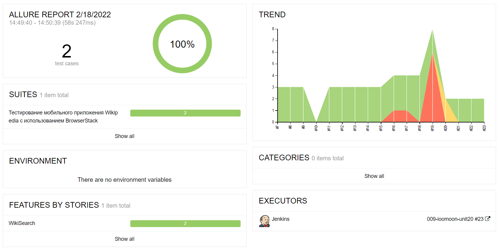
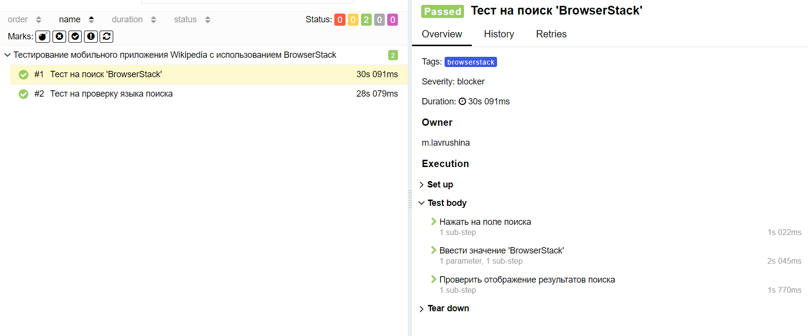
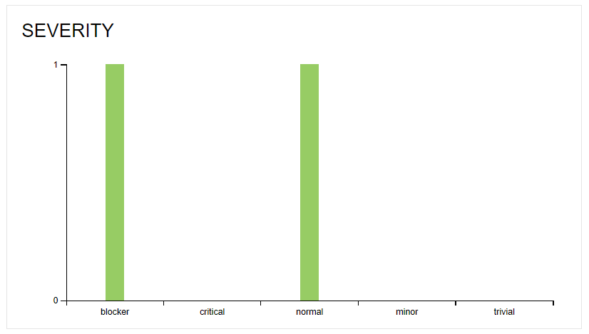
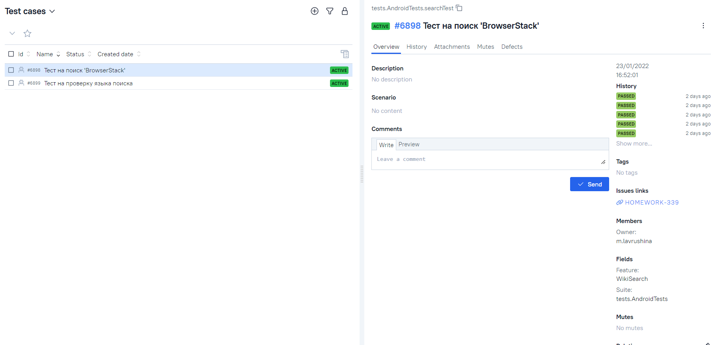
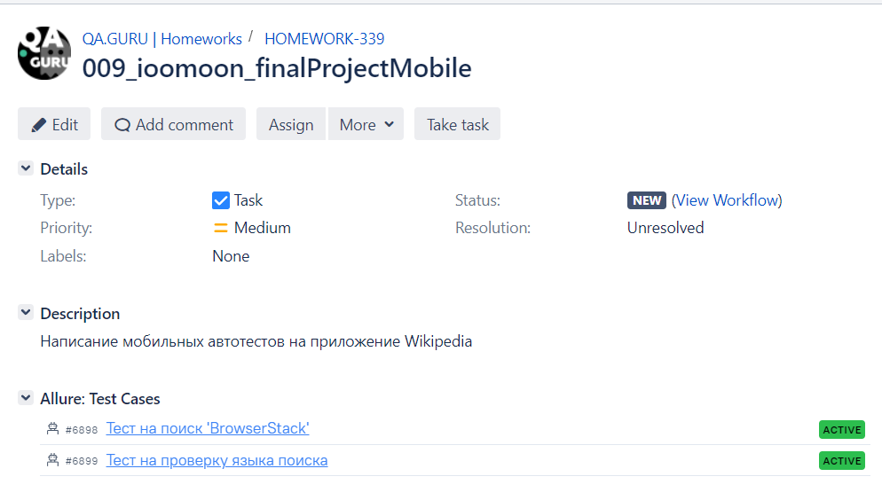
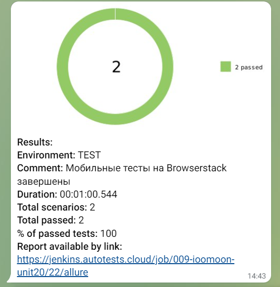

##   Примеры UI автотестов для Android приложения Wikipedia

##  Автоматизированны тест-кейсы:
- Отображение результатов поиска 'BrowserStack'
- Поиск осуществляется на английском языке 

### Стек технологий:

##  Отчеты в Allure Report

##  Интеграция тестов c тест-менеджмент системой Allure TestOps

##  Интеграция тестов c таск-трекер системой Jira

##  Telegram-уведомления о прохождении тестов
